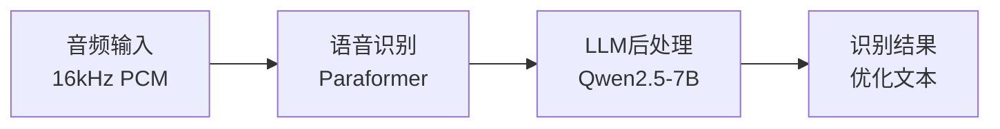

# 🎙️ FunASR MCP 服务器

[](https://www.python.org/downloads/)
[](https://github.com/modelscope/FunASR)
[](https://github.com/jlowin/fastmcp)
[](LICENSE)

> 专业的中文语音识别MCP服务器，支持实时流式识别和LLM后处理

**快速导航**: [快速开始](#-快速开始) • [功能特性](#-功能特性) • [使用指南](#-使用指南) • [API文档](#-api-端点)

---

## 📖 简介

基于阿里达摩院 [FunASR](https://github.com/modelscope/FunASR) 和 [FastMCP](https://github.com/jlowin/fastmcp) 框架构建的语音识别服务器，提供企业级中文语音识别能力。

### 🎯 核心优势

- 🏆 **高精度识别** - 采用Paraformer系列模型，业界领先准确率
- ⚡ **低延迟流式** - 600ms实时响应，支持对话式交互
- 🤖 **AI后处理** - Qwen2.5-7B GGUF模型智能优化识别文本
- 🔒 **本地部署** - 完全离线运行，数据隐私安全
- 🌐 **标准协议** - 完整实现MCP规范，易于集成

## ✨ 功能特性

### 🎯 识别能力

| 功能 | 说明 | 技术 |
|------|------|------|
| **批量识别** | 高精度离线识别 | Paraformer-large |
| **流式识别** | 600ms低延迟实时响应 | Paraformer-Streaming |
| **标点恢复** | 自动添加标点符号 | CT-Transformer |
| **说话人分离** | 识别不同说话人 | CAM++ |
| **热词定制** | 提升特定词汇准确率 | 自定义词表 |

### 🔊 音频处理

| 功能 | 说明 | 技术 |
|------|------|------|
| **VAD检测** | 智能语音活动检测 | FSMN-VAD |
| **流式优化** | 智能文本后处理（实时识别） | Qwen2.5-7B GGUF |

### 🛠️ 系统能力

- ✅ **浏览器支持** - 直接上传录音文件识别
- ✅ **高并发** - 线程安全，多客户端并发
- ✅ **MCP协议** - 完整实现标准规范
- ✅ **实时监控** - 连接状态和性能监控
- ✅ **本地部署** - 无需API，数据安全

## 📋 系统要求

- **Python**: 3.10 或更高版本
- **操作系统**: Linux / macOS / Windows
- **内存**: 推荐 16GB 以上
- **磁盘空间**: 约 20GB (ASR模型3GB + LLM模型14GB)
- **GPU**: NVIDIA GPU + CUDA 11.x+ (推荐，~14GB显存用于LLM)

## 🚀 快速开始

### 步骤1: 环境准备

```bash
# 克隆项目
git clone https://github.com/WAASSTT/mcp-server-funasr.git
cd mcp-server-funasr

# 安装依赖
chmod +x setup.sh
./setup.sh
```

### 步骤2: 启动服务

```bash
# 基础启动（默认启用LLM后处理）
python main.py

# 仅ASR模式（关闭后处理器，节省资源）
# 修改 main.py 中 Config.ENABLE_POSTPROCESSOR = False

# 生产环境（多进程）
uvicorn main:app --host 0.0.0.0 --port 8000 --workers 4
```

**首次启动**: 会自动下载所需模型到 `./Model` 目录

- ASR模型: ~1.8GB (实时 Paraformer-Streaming)
- ASR模型: ~1.0GB (批量 Paraformer-large)
- VAD模型: ~4MB (FSMN-VAD)
- 批量增强: ~283MB (CT-Punc 标点) + ~28MB (CAM++ 说话人)
- LLM模型: ~4.5GB (Qwen2.5-7B-Instruct GGUF)

### 步骤3: 验证服务

```bash
# 健康检查
curl http://localhost:8000/health

# 查看活跃连接
curl http://localhost:8000/connections
```

**提示**: 首次启动需要下载约17GB模型文件，请确保网络畅通和磁盘空间充足。

## 📚 使用指南

### 方式1: Python客户端 - 批量识别

```bash
# 基础识别
python client_batch.py transcribe audio/test.wav

# VAD分段识别
python client_batch.py transcribe audio/test.wav --vad
```

### 方式2: Python客户端 - 实时识别

```bash
# 显示模式（终端显示）
python client_realtime.py

# 输入法模式（自动输入文本）
python client_realtime.py --input-mode --show-status
```

### 方式3: WebSocket API

```javascript
const ws = new WebSocket('ws://localhost:8000/ws/realtime');

ws.onopen = () => {
    ws.send(JSON.stringify({ type: 'start' }));
    ws.send(audioBuffer);  // 16kHz, 16-bit PCM
};

ws.onmessage = (event) => {
    const data = JSON.parse(event.data);
    console.log('识别结果:', data.text);
};
```

## 🎯 技术架构

### 处理流程



### 核心技术栈

#### 1. 语音识别 - Paraformer系列

**模型**: Paraformer-large / Paraformer-Streaming
**特性**: 内置VAD、高精度、低延迟

- 🎯 模型级智能VAD，零额外延迟
- 📝 自动标点恢复（CT-Transformer）
- 👥 说话人分离（CAM++）
- ⚡ 600ms实时响应

#### 2. 流式后处理器 - 统一优化架构

**协同设计**: ASR听清 + LLM说人话
**模型**: Qwen2.5-7B-Instruct GGUF (Q4_K_M)
**特点**: 智能缓冲、上下文感知、质量保证

- ✨ 口语转书面语（LLM优化）
- 📝 基于停顿的智能句子检测（VAD驱动）
- 🎯 多层Fallback机制（LLM → 规则 → 原文）
- 💡 词级时间戳对齐
- 🔍 质量检查和验证

**工作原理**：
- 说话时持续累积文本
- 停顿时（VAD检测到静音）输出完整段落
- 不基于标点符号强制分割

### 技术优势

| 特性 | 传统方案 | 本方案 |
|------|---------|--------|
| VAD检测 | 独立模块 | ✅ 模型内置，零延迟 |
| 文本优化 | 规则后处理 | ✅ 流式后处理器（智能缓冲+上下文+质量检查） |
| 部署方式 | 依赖API | ✅ 完全本地化 |
| 数据安全 | 云端传输 | ✅ 本地处理 |

## ⚙️ 配置说明

所有配置在 `main.py` 的 `Config` 类中集中管理：

### 服务器配置

```python
class Config:
    SERVER_HOST = "0.0.0.0"          # 监听地址
    SERVER_PORT = 8000               # 监听端口
    TIMEOUT_KEEP_ALIVE = 75          # 连接保持超时
```

### 识别配置

```python
    # 实时识别
    REALTIME_MODEL = "paraformer-zh-streaming"
    REALTIME_CHUNK_SIZE = [0, 10, 5]  # 600ms延迟

    # 批量识别
    BATCH_MODEL = "paraformer-zh"
    BATCH_VAD_MODEL = "fsmn-vad"
    BATCH_PUNC_MODEL = "ct-punc-c"
    BATCH_SPK_MODEL = "cam++"
    BATCH_HOTWORD = "魔搭"            # 热词定制

    # 设备自动检测（v3.0.0+）
    # 无需手动配置DEVICE，系统会自动检测GPU/CPU
```

### 延迟优化

通过 `REALTIME_CHUNK_SIZE` 调整延迟：

| chunk_size | 延迟 | 适用场景 |
|-----------|------|----------|
| [0, 5, 5] | 300ms | 对话式交互 |
| [0, 8, 4] | 480ms | 一般场景 |
| [0, 10, 5] | 600ms | 默认推荐 |

### 功能开关

```python
    # 流式后处理器（v4.0.0+ 统一架构）
    ENABLE_POSTPROCESSOR = True
    POSTPROCESSOR_MODEL_PATH = "Model/models/Qwen/qwen2.5-7b-instruct-q4_k_m.gguf"
    POSTPROCESSOR_N_GPU_LAYERS = None  # 自动检测GPU并分配层数
    POSTPROCESSOR_TEMPERATURE = 0.3
    POSTPROCESSOR_CONTEXT_WINDOW = 3
    POSTPROCESSOR_MIN_BUFFER = 2
    POSTPROCESSOR_MAX_BUFFER = 5
    POSTPROCESSOR_QUALITY_CHECK = True
```

**硬件建议**:

- **最小配置**: CPU + 8GB内存 (仅ASR，关闭LLM)
- **推荐配置**: GPU(14GB显存) + 16GB内存 (完整功能)
- **最佳配置**: GPU(24GB显存) + 32GB内存 (生产环境)

## 📊 API 端点

| 端点 | 方法 | 说明 |
|------|------|------|
| `/mcp` | POST | MCP 协议端点 |
| `/upload-audio` | POST | 浏览器音频上传 |
| `/ws/realtime` | WebSocket | 实时流式识别 |
| `/health` | GET | 健康检查 |
| `/connections` | GET | 活跃连接状态 |

## 🎯 使用的模型

### 批量识别

- **ASR**: `paraformer-zh` - 高精度非流式识别
- **VAD**: `fsmn-vad` - 语音活动检测
- **标点**: `ct-punc` - 标点符号恢复
- **说话人**: `cam++` - 说话人分离

### 实时识别

- **流式 ASR**: `paraformer-zh-streaming` - 低延迟流式识别，内置 VAD

## 📁 项目结构

```text
mcp-server-funasr/
├── main.py                       # 服务器主程序 (FastMCP+Starlette)
├── pyproject.toml                # 项目配置和依赖
├── setup.sh                      # 一键安装脚本
├── download_models.py            # 模型下载工具
├── client_batch.py               # 批量识别客户端
├── client_realtime.py            # 实时识别客户端
├── core/                         # 核心模块
│   ├── batch_transcriber.py      # 批量识别器
│   ├── realtime_transcriber.py   # 实时识别器
│   ├── streaming_postprocessor.py # 统一流式后处理器
│   └── device_utils.py           # 设备检测工具
├── audio/                        # 测试音频样本
└── Model/                        # 模型缓存(自动下载)
    └── models/
        ├── iic/                  # FunASR 模型
        └── Qwen/                 # Qwen2.5-7B-Instruct GGUF
```

## ❓ 常见问题

### Q: 流式后处理器需要GPU吗？

**A**: 推荐使用GPU，但非必需

- **GPU模式**: ~14GB显存，推理快 (推荐)
- **CPU模式**: 较慢但可用，需要16GB+内存

配置: 修改 `main.py` 中 `Config.POSTPROCESSOR_N_GPU_LAYERS = 0` (强制CPU)

### Q: 如何降低资源占用？

**A**: 可以关闭流式后处理器

```python
Config.ENABLE_POSTPROCESSOR = False  # 仅使用ASR
```

这样只需要 ~3GB 磁盘空间和 8GB 内存。

### Q: 支持哪些音频格式？

**A**: 支持常见格式

- 推荐: WAV (16kHz, 16-bit, mono)
- 支持: MP3, FLAC, OGG, WEBM等

## 🔍 故障排除

### 模型下载失败

```bash
export HF_ENDPOINT=https://hf-mirror.com
python download_models.py
```

### GPU 问题

```bash
# 检查 CUDA
python -c "import torch; print(torch.cuda.is_available())"

# 使用 CPU
# 在 main.py 中设置 device="cpu"
```

### 内存不足

- 降低 `batch_size_s` 参数
- 减少 `ncpu` 线程数
- 限制并发连接数

### 连接问题

```bash
# 检查端口
netstat -tulpn | grep 8000

# 查看连接
curl http://localhost:8000/connections
```

## 📝 性能优化

### ASR 优化

```python
# v3.0.0+ 设备自动检测，无需手动配置
# 系统会自动选择最佳设备（GPU优先，CPU备选）

Config.BATCH_SIZE_S = 300          # 调整批处理大小
Config.BATCH_NCPU = 8              # CPU线程数（多线程加速）
```

### LLM 优化

```python
# 使用量化模型（开发中）
# LLM_MODEL = "Qwen/Qwen2.5-7B-Instruct-GPTQ-Int4"

# 使用更小的模型
LLM_MODEL = "Qwen/Qwen2.5-3B-Instruct"  # 更快但效果稍差
```

### 生产部署

```bash
# 多进程部署
uvicorn main:app --workers 4 --host 0.0.0.0 --port 8000

# Nginx反向代理
# 负载均衡 + SSL终端

# Docker部署
# 容器化部署，资源隔离
```

## 📝 更新日志


## 🤝 贡献指南

欢迎提交 Issue 和 Pull Request！请遵循以下规范：

- 提交前运行测试
- 遵循代码风格
- 更新相关文档

## 📄 许可证

本项目采用 MIT License - 详见 [LICENSE](LICENSE)

## 🙏 致谢

- [FunASR](https://github.com/modelscope/FunASR) - 阿里达摩院语音实验室提供的强大ASR框架
- [FastMCP](https://github.com/jlowin/fastmcp) - 优秀的MCP协议框架
- [ModelScope](https://www.modelscope.cn/) - 提供模型托管和下载服务
- [Qwen2.5](https://www.modelscope.cn/models/Qwen/Qwen2.5-7B-Instruct) - 智能文本后处理支持

## 🔗 相关链接

- **项目文档**: [GitHub Repository](https://github.com/WAASSTT/mcp-server-funasr)
- **FunASR文档**: [官方教程](https://github.com/modelscope/FunASR/blob/main/docs/tutorial/README_zh.md)
- **MCP规范**: [Model Context Protocol](https://modelcontextprotocol.io/)
- **ModelScope**: [模型库](https://www.modelscope.cn/models)

---

**当前版本**: v4.0.0
**最后更新**: 2025-12-23
**作者**: WAASSTT

[⬆ 返回顶部](#️-funasr-mcp-服务器)
